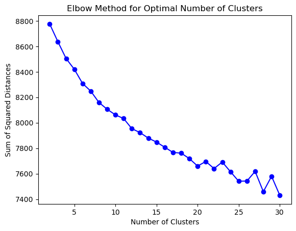
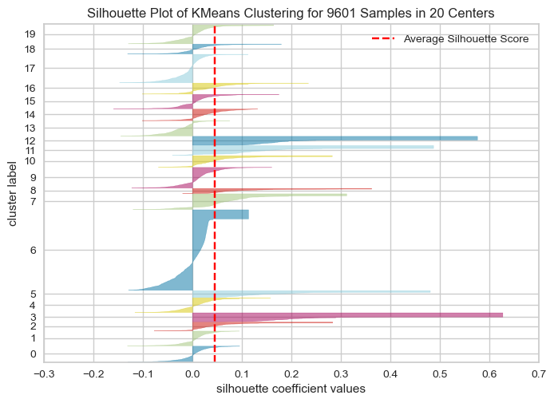

# Customer Review Analysis

The project aims to analyze reviews of watches. Customer review data is an important information source to understand customer experience. The numerical rating of a product provides an overall feedback, while customer reviews help us to learn the aspects of product or service customers care most. To analyze the text information, I use Natural Language Processing (NLP) techniques to clean text data and to identify latent topics in the reviews.

## Project Structure
`data/': the dataset contains more than 960,000 customer reviews of watches sold on US Amazon. 

## Data Exploration

### Lemmatizing

After removing stop words, I lemmatize the words.

### What is tfidf?
I compute term frequency for 352 words in a document, and I also compute inverse document frequency, and the product of the two metrics and get tf-idf. 

## K-means Clustering
The first model I use to group customer reviews is K-means clustering. K-means clustering helps me to compare the overall similarity between reviews. I first assume there are 5 clusters, same as the scale of star ratings in the dataset. Most reviews are clustered in 2 groups. I also use the elbow method and calculate silhouette scores to search for the optimal number of clusters.

## Topic Modeling
By using latent dirichlet allocation (LDA), I discover 5 topics among the watch reviews, and I assign each review to a topic according to the document-topic distributions. Most of the topics are related to the look and quality of watches. However, there is one topic deviating from others. The words that co-occur under the topic include gift, love, wife, and husband, which are not directly linked to watches. This suggests some of the purchases were actually gifts to significant others. Hence, if we can further examine purchase dates, Amazon can target these customers using discounts or advertisements in a specific period of time.

